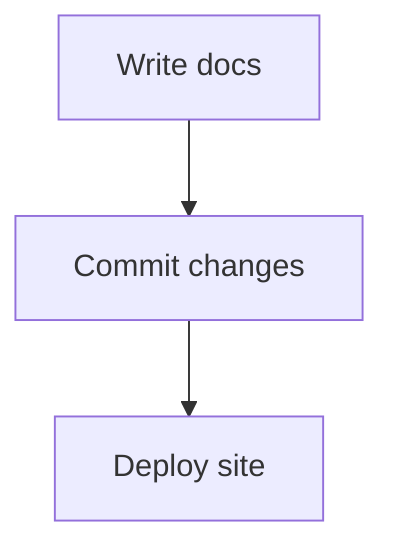

# Getting Started

## Run Locally

Install dependencies:

```bash
npm install
```

Start the dev server:

```bash
npm run dev
```

Open `http://localhost:3000` to view your docs site.

## Add Pages

Create Markdown or MDX files in `content/`, then list them in `content/config.json` if you want them to appear in the sidebar.

## Mermaid Diagrams

Mermaid code fences render automatically:


